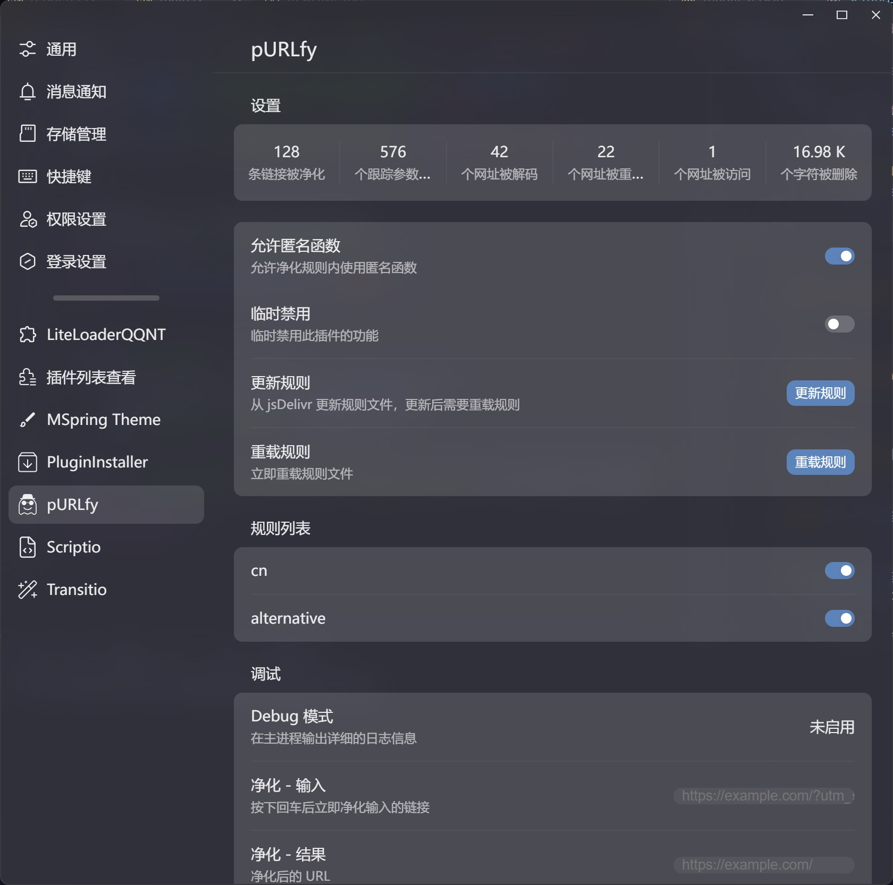

</img>

# pURLfy

> 🧹 pURLfy, 取自 "purify" 和 "URL" 的结合，意为净化 URL 链接。

[LiteLoaderQQNT](https://github.com/mo-jinran/LiteLoaderQQNT) 插件，用于净化 QQNT 中的 URL 链接。此插件灵感来源于 [Tarnhelm](https://tarnhelm.project.ac.cn/)。

## 🪄 具体功能

- 自动净化将要在浏览器打开的 URL 链接 (`shell.openExternal`)
- 临时禁用：在插件设置中可以临时禁用插件的净化功能，以便在需要时打开原始链接
- 统计数据：净化的链接数量、净化的参数数量、净化的字符数量
    - \* 仅在程序正常退出时才会保存数据

## 🖼️ 截图



## 📥 安装

### 插件商店

~~在插件商店中找到 pURLfy 并安装。~~

### 手动安装

- 稳定版: 下载 Release 中的 `purlfy-release.zip`，解压后放入[数据目录](https://github.com/mo-jinran/LiteLoaderQQNT-Plugin-Template/wiki/1.%E4%BA%86%E8%A7%A3%E6%95%B0%E6%8D%AE%E7%9B%AE%E5%BD%95%E7%BB%93%E6%9E%84#liteloader%E7%9A%84%E6%95%B0%E6%8D%AE%E7%9B%AE%E5%BD%95)下的 `plugins/purlfy` 文件夹中即可。(若没有该文件夹请自行创建)
- CI 版: 若想体验最新的 CI 功能，可以下载源码后同上安装。(仅需下载下面列出的文件)

完成后的目录结构应该如下:

```
plugins (所有的插件目录)
└── purlfy (此插件目录)
    ├── manifest.json (插件元数据)
    ├── main.js (插件脚本)
    ├── preload.js (插件脚本)
    ├── renderer.js (插件脚本)
    ├── rules.json (净化规则)
    ├── settings.html (插件设置界面)
    └── icons/ (插件用到的图标)
```

## 🤔 使用方法

打开插件后自动生效。

## 📃 规则

> 部分规则来源于 [Tarnhelm](https://tarnhelm.project.ac.cn/rules.html)。

规则文件 `rules.json` 的格式如下:

```json
{
    "<domain>": {
        "<path>": {
            "description": "<规则描述>",
            "mode": <模式>,
            "params": ["<param 1>", "<param 2>", ...],
            "author": "<作者>"
        }
    }
}
```

- `<domain>`, `<path>`: 域名和路径，例如 `example.com/`, `path/to/page` (去除前面的 `/`)
    - 若为 `""`，则表示作为 **FallBack** 规则：当此层级没有匹配到其他规则时使用此规则
    - 若不以 `/` 结尾，表示其值就是一个规则
    - 若以 `/` 结尾，表示其下有更多子路径 (可以多级嵌套)
- `<模式>`: 规则模式，`0` 为白名单，`1` 为黑名单~~，`2` 为正则表达式，`3` 为取特定参数~~
- `<param n>`: 参数名

### 路径匹配

一个简单的例子，规则描述内给出了可以匹配的网址:

```json
{
    "example.com/": {
        "a/b/c": {
            "description": "example.com/a/b/c",
            "mode": 0,
            "params": [],
            "author": "PRO-2684"
        },
        "path/": {
            "to/": {
                "page": {
                    "description": "example.com/path/to/page",
                    "mode": 0,
                    "params": [],
                    "author": "PRO-2684"
                },
                "": {
                    "description": "example.com/path/to",
                    "mode": 0,
                    "params": [],
                    "author": "PRO-2684"
                }
            }
        },
        "": {
            "description": "example.com/*",
            "mode": 0,
            "params": [],
            "author": "PRO-2684"
        }
    },
    "example.org": {
        "description": "example.org/*",
        "mode": 0,
        "params": [],
        "author": "PRO-2684"
    },
    "": {
        "description": "Fallback",
        "mode": 0,
        "params": [
            "utm_source",
            "utm_medium",
            "utm_campaign",
            "utm_term",
            "utm_content"
        ],
        "author": "PRO-2684"
    }
}
```

以下是***错误示范***:

```jsonc
{
    "example.com/": {
        "path/to/page/": { // 以 `/` 结尾的会被认为下面有子路径，正确写法是把 `path/to/page/` 改为 `path/to/page`
            "description": "example.com/path/to/page",
            "mode": 0,
            "params": [],
            "author": "PRO-2684"
        }
    },
    "example.org": { // 不以 `/` 结尾的会被认为是一个规则，正确写法是把 `example.org` 改为 `example.org/`
        "path/to/page": {
            "description": "example.com/path/to/page",
            "mode": 0,
            "params": [],
            "author": "PRO-2684"
        }
    }
}
```

### 白名单模式

白名单模式下，只有在 `params` 中指定的参数才会被保留，原网址中的其余参数会被删除。

### 黑名单模式

黑名单模式下，在 `params` 中指定的参数将会被删除，原网址中的其余参数会被保留。

### 正则表达式

暂未实现。

### 取特定参数

暂未实现。

## 💻 调试

Debug 模式：若您想要调试**此插件本身**，可以使用 `--purlfy-debug` 参数启动 QQNT，此时插件会在控制台输出调试信息。
