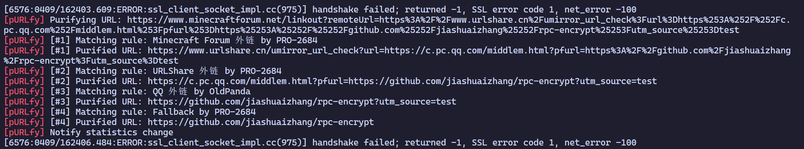

</img>

# pURLfy

> 🧹 pURLfy, 取自 "purify" 和 "URL" 的结合，意为净化 URL 链接，可发音为 `pjuɑrelfaɪ`。

[LiteLoaderQQNT](https://github.com/mo-jinran/LiteLoaderQQNT) 插件，用于净化 QQNT 中的 URL 链接。此插件灵感来源于 [Tarnhelm](https://tarnhelm.project.ac.cn/)。

## 🪄 具体功能

- 手动净化：在插件设置界面中输入链接并回车即可手动净化链接
- 自动净化
    - 自动净化将要在浏览器打开的 URL 链接 (hook `shell.openExternal`)
    - 自动净化发送的**文本消息**中的 URL 链接 (测试中，若想启用请参照 [使用方法](#-使用方法))
- 迭代式净化：支持净化多层嵌套的链接，例如外链中的链接
- 规则热更新：支持在插件设置中更新规则文件
- 启用/禁用规则：在插件设置中可以启用/禁用规则 (各规则说明详见 [pURLfy rules](https://github.com/PRO-2684/pURLfy-rules))
- 临时禁用：在插件设置中可以临时禁用插件的净化功能，以便在需要时打开原始链接
- 统计数据：净化的链接数量、净化的参数数量、解码的网址数量、净化的字符数量
    - \* 仅在程序正常退出时才会保存数据

## 🖼️ 截图




## 📥 安装

### 自动安装

在 [插件安装器](https://github.com/xinyihl/LiteLoaderQQNT-PluginInstaller) 或 [插件列表查看](https://github.com/ltxhhz/LL-plugin-list-viewer) 中找到 pURLfy 并安装。

### 手动安装

- 稳定版: 下载 Release 中的 `purlfy-release.zip`，解压后放入[数据目录](https://github.com/mo-jinran/LiteLoaderQQNT-Plugin-Template/wiki/1.%E4%BA%86%E8%A7%A3%E6%95%B0%E6%8D%AE%E7%9B%AE%E5%BD%95%E7%BB%93%E6%9E%84#liteloader%E7%9A%84%E6%95%B0%E6%8D%AE%E7%9B%AE%E5%BD%95)下的 `plugins/purlfy` 文件夹中即可。(若没有该文件夹请自行创建)
- CI 版: 若想体验最新的 CI 功能，可以下载下面列出的文件后同上安装。其中 `purlfy.js` 以及规则文件 `rules/` 未包含在此仓库内，您可以从 [pURLfy core](https://github.com/PRO-2684/pURLfy/blob/main/purlfy.js) 和 [pURLfy rules](https://github.com/PRO-2684/pURLfy-rules/) 获取。

完成后的目录结构应该如下:

```
plugins (所有的插件目录)
└── purlfy (此插件目录)
    ├── manifest.json (插件元数据)
    ├── purlfy.js (插件核心)
    ├── main.js (插件脚本)
    ├── preload.js (插件脚本)
    ├── renderer.js (插件脚本)
    ├── settings.html (插件设置界面)
    ├── icons/ (插件用到的图标)
    └── rules/ (净化规则)
```

## 🤔 使用方法

打开插件后自动生效。若想手动净化链接，可以在设置界面输入链接后回车。若想启用测试中的“净化发送的文本消息”，请修改 `config.json` 中 `hooks.sendMessage` 为  `true`。以下是一些测试链接：

- BiliBili 短链: `https://b23.tv/SI6OEcv`
- 中规中矩的贴吧分享链接: `https://tieba.baidu.com/p/7989575070?share=none&fr=none&see_lz=none&share_from=none&sfc=none&client_type=none&client_version=none&st=none&is_video=none&unique=none`
- MC 百科外链: `https://link.mcmod.cn/target/aHR0cHM6Ly9naXRodWIuY29tL3dheTJtdWNobm9pc2UvQmV0dGVyQWR2YW5jZW1lbnRz`
- 必应的搜索结果: `https://www.bing.com/ck/a?!&&p=de70ef254652193fJmltdHM9MTcxMjYyMDgwMCZpZ3VpZD0wMzhlNjdlMy1mN2I2LTZmMDktMGE3YS03M2JlZjZhMzZlOGMmaW5zaWQ9NTA2Nw&ptn=3&ver=2&hsh=3&fclid=038e67e3-f7b6-6f09-0a7a-73bef6a36e8c&psq=anti&u=a1aHR0cHM6Ly9nby5taWNyb3NvZnQuY29tL2Z3bGluay8_bGlua2lkPTg2ODkyMg&ntb=1`
- 套娃 N 次后甚至无法正常访问的外链: `https://www.minecraftforum.net/linkout?remoteUrl=https%3A%2F%2Fwww.urlshare.cn%2Fumirror_url_check%3Furl%3Dhttps%253A%252F%252Fc.pc.qq.com%252Fmiddlem.html%253Fpfurl%253Dhttps%25253A%25252F%25252Fgithub.com%25252Fjiashuaizhang%25252Frpc-encrypt%25253Futm_source%25253Dtest`

## ❤️ 贡献

欢迎提交 PR 或 Issue 来改进此插件。此插件基于 [pURLfy core](https://github.com/PRO-2684/pURLfy)，它是 pURLfy 的核心部分，独立为一个 JavaScript 库，用于净化 URL 链接。若此插件无法正常工作，请在此仓库中提交 Issue 或 PR；若净化链接有问题，请在 [pURLfy core](https://github.com/PRO-2684/pURLfy) 仓库中提交 Issue 或 PR；若想要完善净化规则，请在 [pURLfy rules](https://github.com/PRO-2684/pURLfy-rules) 仓库中提交 Issue 或 PR。

若您想要调试此插件或规则文件，可以使用 `--purlfy-debug` 参数激活 Debug 模式，此时插件会在控制台输出调试信息。

## 🎉 鸣谢

- 感谢 [Tarnhelm](https://tarnhelm.project.ac.cn/) 提供的规则文件，为 pURLfy 提供了很多灵感
- 感谢 GreasyFork 上的 [这个脚本](https://greasyfork.org/scripts/412612)，为 pURLfy 提供了一些规则
